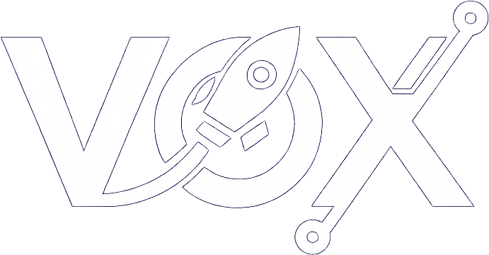

# 🔐 Tela de Login - Projeto VOX

Este é um projeto de **tela de login estilizada**, desenvolvido com foco em **design moderno, acessibilidade e responsividade**. A interface utiliza uma paleta de tons violetas com visual translúcido e toques de tecnologia, refletindo a identidade da marca **VOX**.



---

## 🧩 Recursos

- 🎨 Estilo moderno com **efeito glassmorphism**
- 🧠 Ícones personalizados com **Font Awesome**
- 📱 Layout **responsivo** para dispositivos móveis
- 🌈 Botão com **gradiente animado**
- 🔐 Campo de login com **efeito de preenchimento automático** customizado
- 🔗 Links para "Lembrar-me", "Esqueci minha senha" e "Cadastre-se"

---

## 🛠️ Tecnologias Utilizadas

- **HTML5** semântico
- **CSS3** com Flexbox, gradientes e backdrop-filter
- **Font Awesome** para ícones
- **Imagens personalizadas** para logotipo, fundo e favicon

---

## 📁 Estrutura de Pastas

```
📁 projeto-login-vox/
├── index.html
├── css/
│   └── style2.css
├── img/
│   ├── logo1.png
│   ├── favicon1.png
│   └── img.jpg
```

---

## 📷 Demonstração


---

## 📌 Como Usar

1. Clone o repositório:
   ```bash
   git clone https://github.com/seu-usuario/projeto-login-vox.git
   ```
2. Abra o arquivo `index.html` no navegador.
3. Personalize conforme necessário!

---

## 👨‍💻 Autor

Desenvolvido por **Fabricio Bezerra**  
📧 [Entre em contato](mailto:fabriciofrontdev@gmail.com)  
🔗 [LinkedIn](https://www.linkedin.com/in/fabriciobzrr)

---

## ⚠️ Licença

Este projeto é livre para uso educacional. Sinta-se à vontade para adaptar e melhorar! 🚀
